# Installing and migrating tabs

## 1. Preparing for migration

### 1.1. Go to "[chrome://extensions/](chrome://extensions/)", and make sure you have the original extension active.

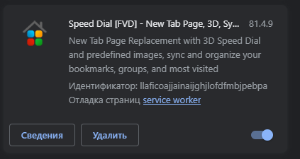

### 1.2. Open the "[Speed Dial](chrome-extension://kdahjheocamiknmlpiinagkkkcmpcbmal/options.html)" menu, expand the top right sidebar and click on the gear icon.

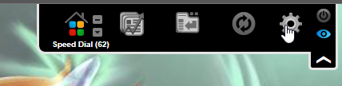

### 1.3. Click on the "Export" button.

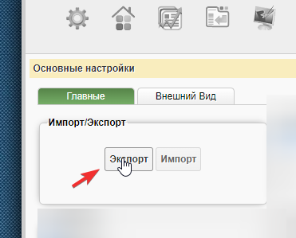

### 1.4. A menu with the text will open. Copy the text to the clipboard.

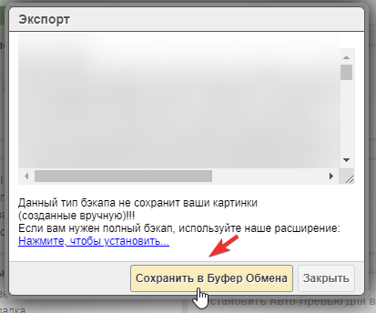

### 1.5. Save the text from the clipboard to any text document. Create a text file with an arbitrary name, open it, and paste the text into it using the "Ctrl + V" key combination. After pasting, save the file and close it temporarily.

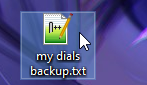

### 1.6. Go to "[chrome://extensions/](chrome://extensions/)" and disable the original extension.

## 2. Patch Installation

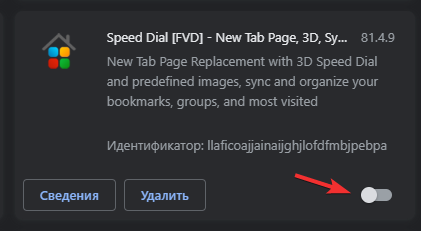

### 2.1. Follow the link for the latest up-to-date version of the patch - https://github.com/Shark-vil/speed-dial-fvd-no-ads-patch/releases/latest

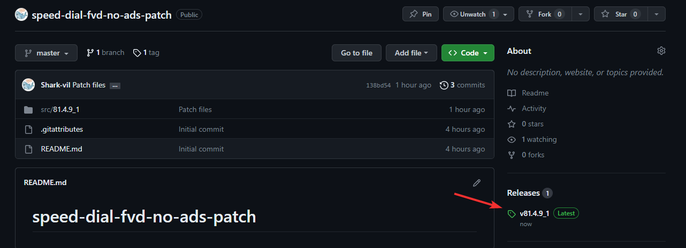

### 2.2. Download the ".zip" archive with the latest patch.

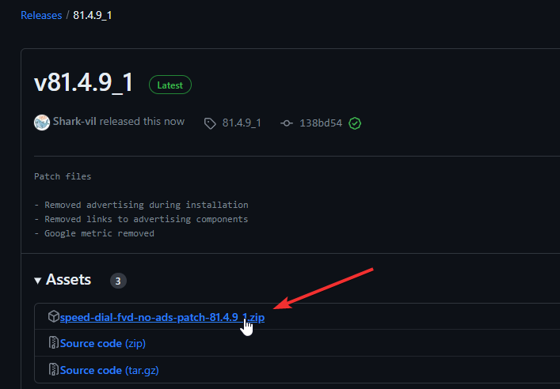

### 2.3. Unzip the contents of the archive to any convenient place for you. For example, you can create a separate folder in "Documents".

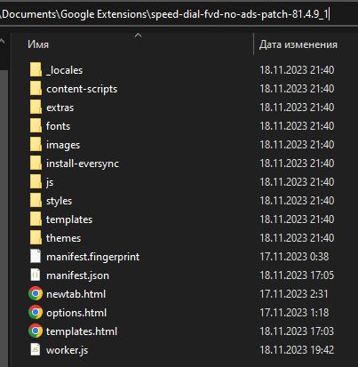

### 2.4. Go back to the "[chrome://extensions/](chrome://extensions/)" tab and enable developer tools with the switch in the upper right corner. Once activated, you will have additional buttons. Use the first button in the list to specify the path to the local extension.

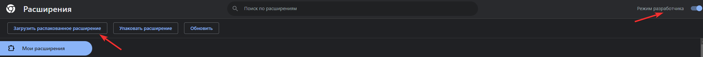

### 2.5. Specify the path to the folder where you unzipped the archive.

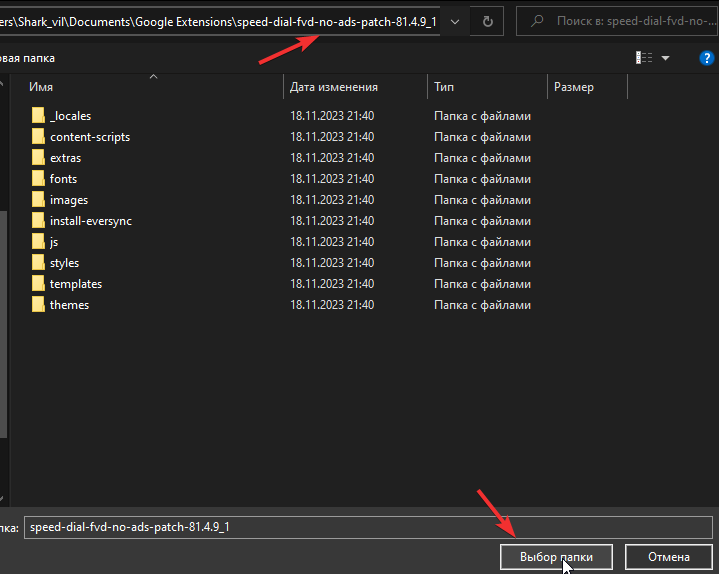

### 2.6. После добавления, расширение появится в списке, и должна произойти переадресация в меню настройки. Если этого не произошло, просто откройте [пустую вкладку](chrome://newtab/).

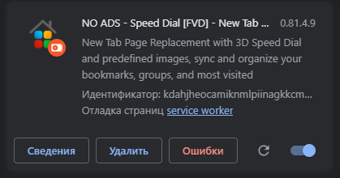

(*Ignore the "Errors" button*)

### 2.7. Confirm the changes made by the extension. Then go through the basic configuration.

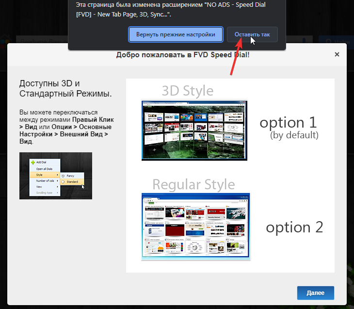

### 2.8. After customization, the menu should look like this. No ads at the start!

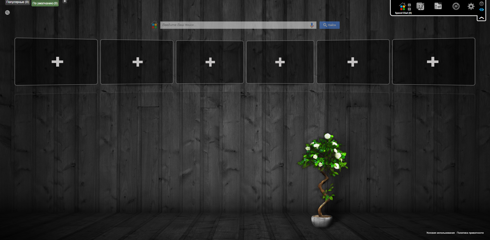

(*You can disable the search bar in the settings.*)

## 3. Restoring tabs

### 3.1. Go back to the menu with [settings](chrome-extension://kdahjheocamiknmlpiinagkkkcmpcbmal/options.html) of the extension.

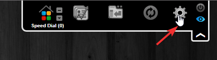

### 3.2. Click on the "Import" button.

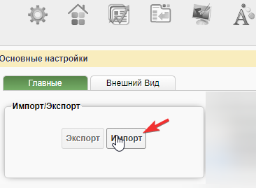

### 3.3. A window with an empty text field will open. In this field, copy and paste the text that you saved earlier in step "1.5".

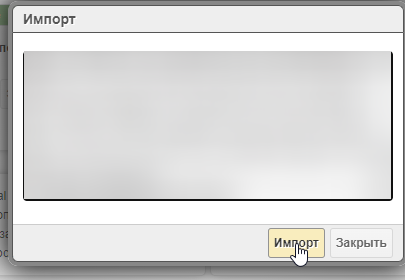

### 3.4. Confirm import with replacement.

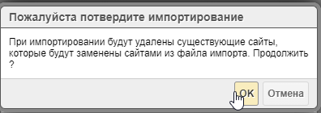

### 3.5. Пreat! Now all the tabs are back with you. We just have to wait for the thumbnail creation to complete. For some tabs, you will have to customize the images again.

