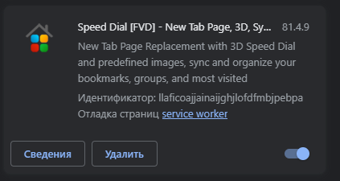
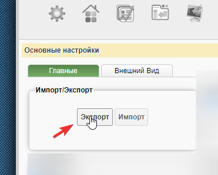
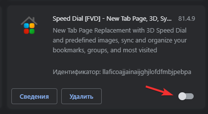
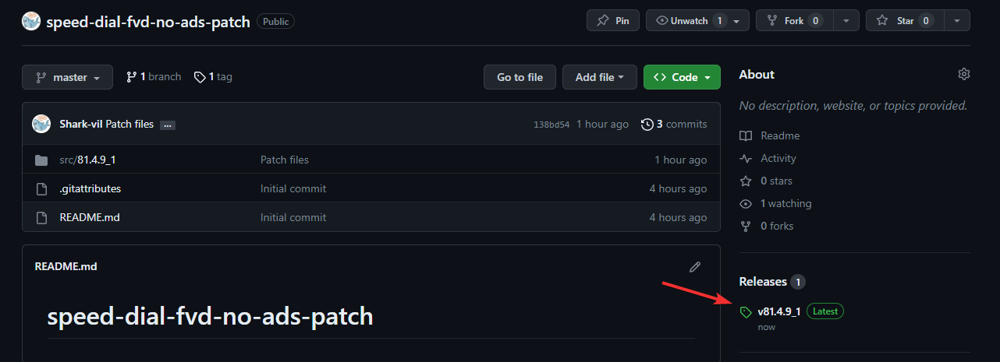
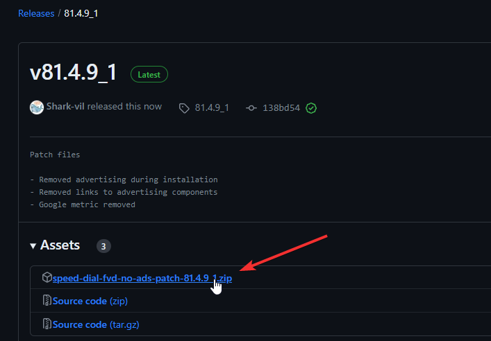
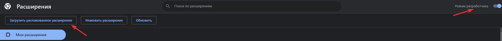
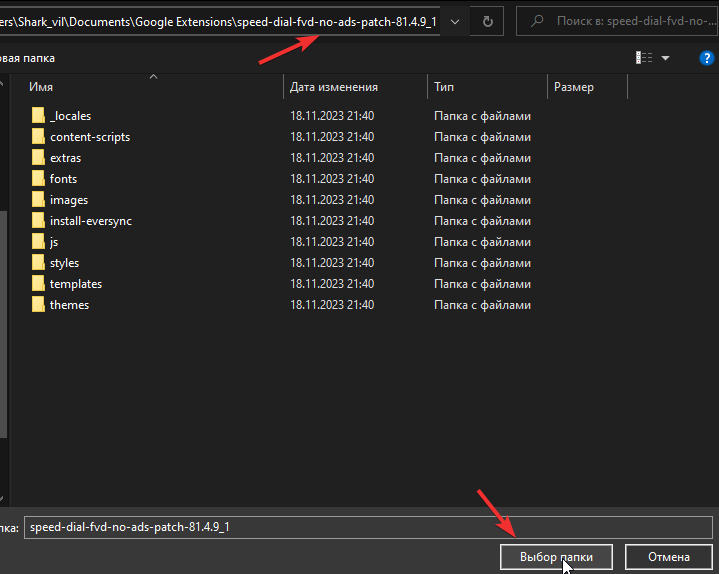
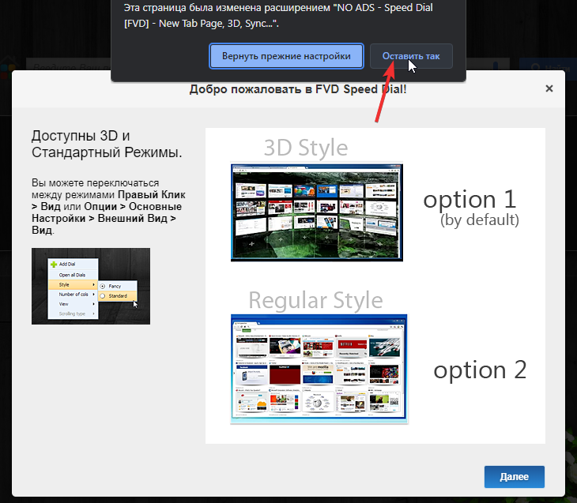
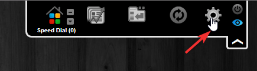
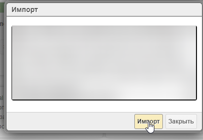

# Установка и миграция вкладок

## 1. Подготовка к миграции

### 1.1. Перейдите по адресу "[chrome://extensions/](chrome://extensions/)", и убедитесь, что у вас активно оригинальное расширение.

### 1.2. Откройте меню "[Speed Dial](chrome-extension://kdahjheocamiknmlpiinagkkcmpcbmal/options.html)", разверните боковую правую верхнюю панель и нажмите на значок шестерёнки.

### 1.3. Нажмите на кнопку "Экспорт".

### 1.4. Откроется меню с текстом. Скопируйте текст в буфер обмена.

### 1.5. Сохраните текст из буфера обмена в любой текстовый документ. Создайте текстовый файл с произвольным наименованием, откройте его, и вставьте туда текст, используя комбинацию клавиш "Ctrl + V". После вставки сохраните файл и временно закройте его.

### 1.6. Перейдите по адресу "[chrome://extensions/](chrome://extensions/)" и отключите оригинальное расширение.

## 2. Установка патча

---

### Рекомендация

Во избежание возможных проблем, рекомендуется очистить историю кеша браузера за всё время.

**Только историю кеша! Не просмотров, куки и т.д.**

---

### 2.1. Перейдите по ссылке для получения последней актуальной версии патча - https://github.com/Shark-vil/speed-dial-fvd-no-ads-patch/releases/latest

### 2.2. Скачайте ".zip" архив с последним патчем.

### 2.3. Распакуйте содержимое архива в любое удобное для вас место. Например, вы можете создать отдельную папку в "Документы".

### 2.4. Вернитесь на вкладку "[chrome://extensions/](chrome://extensions/)" и включите инструменты разработчика переключателем в правом верхнем углу. После активации у вас появятся дополнительные кнопки. Используйте первую кнопку в списке, чтобы указать путь до локального расширения.

### 2.5. Указывайте путь до папки, куда вы распаковали архив.

### 2.6. После добавления, расширение появится в списке, и должна произойти переадресация в меню настройки. Если этого не произошло, просто откройте [пустую вкладку](chrome://newtab/).

(*Не обращайте внимания на кнопку "Ошибки"*)

### 2.7. Подтвердите изменения которые вносит расширение. После чего пройдите базовую настройку.

### 2.8. После настройки, меню должно выглядеть так. Никакой рекламы на старте!

(*Строку поиска можно отключить в настройках.*)

## 3. Восстановление вкладок

### 3.1. Вернитесь в меню с [настройками](chrome-extension://kdahjheocamiknmlpiinagkkcmpcbmal/options.html) расширения.

### 3.2. Нажмите на кнопку "Импорт".

### 3.3. Откроется окно с пустым текстовым полем. В это поле следует скопировать и вставить текст, который ранее вы сохранили на этапе "1.5".

### 3.4. Подтверждайте импорт с заменой.

### 3.5. Отлично! Теперь все вкладки снова с вами. Осталось подождать завершения создания миниатюр. Для некоторых вкладок вам придётся настроить изображения заново.

